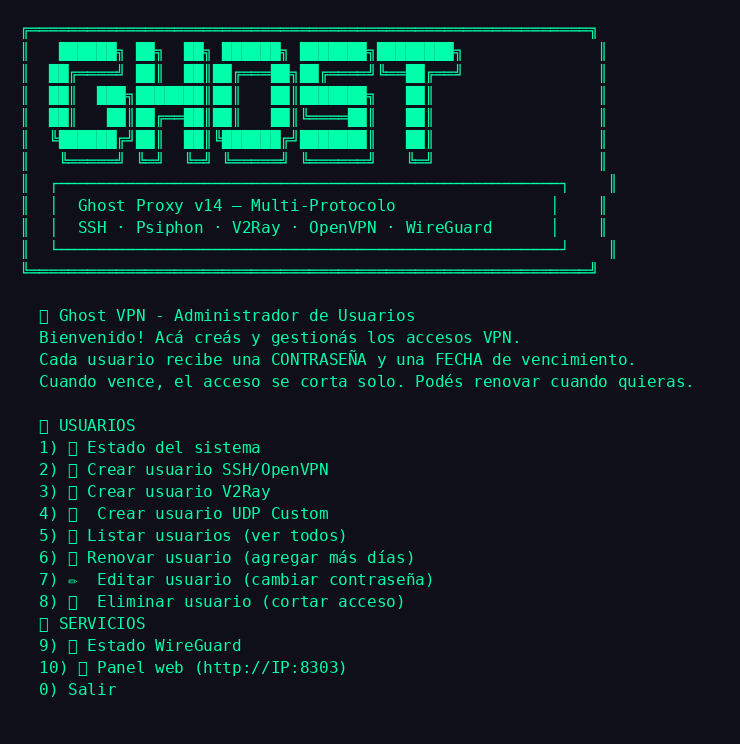

# 🦇 Ghost Proxy v14 — Multi-Protocolo

Instalador automático tipo ADMRufu con **menú completo para novatos**:

**SSH · Psiphon · V2Ray · OpenVPN · WireGuard · UDP Custom**



## 🎨 Banner del Ghost Manager (estilo confirmado)

El banner del `ghost-manager` usa la fuente **`ansi_shadow`** de pyfiglet (bloques con sombra y esquinas `╗╔╝║═`, efecto 3D) con el texto **EPRO.HC** en naranja:

```bash
# Generarlo con:
#   /usr/bin/python3 -m pip install pyfiglet --break-system-packages
python3 -c "import pyfiglet; print(pyfiglet.figlet_format('EPRO.HC', font='ansi_shadow'))"
```

- **Fuente**: `ansi_shadow` (la misma que usaba el banner "GHOST" original)
- **Color**: `ORANGE='\033[38;5;208m'` (naranja intenso)
- **Texto**: `EPRO.HC` todo en mayúsculas (con la E bien formada, no confundir con G)
- **Menú de opciones**: números en fucsia `FUCSIA='\033[1;35m'`
- **Subtítulo**: `🦇 Ghost VPN - Administrador de Usuarios` en azul/cian

## 🚀 Instalación (una línea — instala TODO solo)

```bash
bash <(curl -s https://raw.githubusercontent.com/Agro-bot2026/Dev-proxy/main/ghost-proxy-v14.sh) auto
```

O con wget (si no hay curl):

```bash
wget -qO- https://raw.githubusercontent.com/Agro-bot2026/Dev-proxy/main/ghost-proxy-v14.sh | bash -s auto
```

**El script instala todo automáticamente, sin tocar nada a mano:**

1. ✅ `apt update + upgrade` del sistema (como todos los scripts)
2. ✅ Dependencias (curl, python3, systemd — Debian/Ubuntu/Rocky/Alma/CentOS/Alpine/openSUSE/Arch)
3. ✅ Detecta los servicios del VPS (SSH/V2Ray/Psiphon/OpenVPN/WireGuard)
4. ✅ Proxy multi-protocolo en :80
5. ✅ **Psiphon** (:2223 — banner SSH-2.0-Psiphon + IP pública configurados)
6. ✅ **Xray V2Ray** (:8443 — con xray_uuid.sh para usuarios)
7. ✅ **OpenVPN** (:1194 — certificados + NAT MASQUERADE + forwarding, los clientes navegan)
8. ✅ **WireGuard** (:51820)
9. ✅ BadVPN UDPGW (:7300)
10. ✅ Ghost Manager (menú de usuarios)
11. ✅ Te pide el **dominio** del VPS (para los links de usuarios)
12. ✅ **Abre TODOS los puertos en el firewall** (UFW/firewalld/iptables)
13. ✅ **SSL 443 → proxy WS** (método TLS, stunnel — opcional)

## 🔥 Puertos que abre en el firewall (automático)

| Protocolo | TCP | UDP |
|-----------|:---:|:---:|
| Proxy WS | 80 | 80 |
| SSH | 22 | — |
| Psiphon | 2223 | 2223 |
| Xray V2Ray | 8443 | 8443 |
| OpenVPN | 1194 | 1194 |
| WireGuard | 51820 | 51820 |
| BadVPN | — | 7300 |
| SSL TLS | 443 | — |

Detecta el firewall solo: **UFW** (Debian/Ubuntu), **firewalld** (Rocky/CentOS/Alma), **iptables** (cualquiera). Si UFW está inactivo, no lo fuerza (no corta tu SSH).

## 🔒 SSL 443 → proxy WebSocket (método TLS, sin Caddy)

Igual que en producción (donde CloudRun termina el TLS y reenvía desempaquetado al :80), el instalador puede poner **stunnel**: termina TLS en :443 y reenvía al proxy WS :80.

```
Cliente (HTTP Custom, método TLS)
   ↓ TLS 443
stunnel (cert autofirmado para tu dominio)
   ↓ desempaquetado
Proxy WS :80 → rutea a OpenVPN/SSH/etc.
```

Al instalar te pregunta `🌐 ¿Instalar SSL 443 → proxy (método TLS)? [s/N]`, o en el menú con la opción **18** (`🔒 Instalar SSL 443 → proxy`).

**Detalles técnicos** (ya resueltos en el script):
- `foreground = yes` va GLOBAL (al inicio del conf), no dentro del servicio — si no, stunnel daemoniza y systemd lo reinicia en loop
- Libera el 443 si lo ocupa Caddy/nginx/stunnel4 del paquete antes de arrancar
- Certificado autofirmado en `/etc/stunnel/eprohc.pem` (el .hc usa `allow_insecure: true`)
- Servicio: `stunnel-epro` (systemd, autoarranque)

## 🔄 Actualización del script (auto-update)

El instalador tiene **sistema de actualización integrado**:

- **Aviso automático**: al entrar al menú, compara su versión con la de GitHub y avisa si hay una nueva
- **Opción 19**: `🔄 ACTUALIZAR Ghost Proxy` — descarga, verifica, reemplaza y ejecuta la versión nueva

```bash
# Ver la versión actual
grep '^VERSION=' ghost-proxy-v14.sh
```

## 🧹 Instalación limpia (borra todo lo anterior)

```bash
curl -s "https://raw.githubusercontent.com/Agro-bot2026/Dev-proxy/main/ghost-proxy-v14.sh" -o /tmp/g.sh && bash /tmp/g.sh limpio
```

Borra servicios, configs y binarios viejos, y reinstala desde cero.

## 🖥️ Menú (para crear usuarios y administrar)

```bash
bash <(curl -s https://raw.githubusercontent.com/Agro-bot2026/Dev-proxy/main/ghost-proxy-v14.sh)
```

O después de instalar:

```bash
ghost-manager
```

```
🦇 Ghost VPN - Administrador de Usuarios
  Bienvenido! Acá creás y gestionás los accesos VPN.
  Cada usuario recibe una CONTRASEÑA y una FECHA de vencimiento.
  Cuando vence, el acceso se corta solo. Podés renovar cuando quieras.

  👤 USUARIOS
  1) 📊 Estado del sistema
  2) 👤 Crear usuario SSH
  3) 🛡️  Crear usuario OpenVPN (config armado con payload + CA)
  4) 🚀 Crear usuario V2Ray
  5) 🛰️  Crear usuario UDP Custom
  6) 👥 Listar usuarios (ver todos)
  7) 🔄 Renovar usuario (agregar más días)
  8) ✏️  Editar usuario (cambiar contraseña)
  9) 🗑️  Eliminar usuario (cortar acceso)
  🌐 SERVICIOS
  10) 🌐 Estado Psiphon (server entry + HEX)
  11) 🔐 Estado WireGuard
  12) 🌐 Panel web (http://IP:8303)
  0) Salir
```

**Menú del instalador** (además del ghost-manager):

```
 [1] 🛠️  Instalar / Actualizar proxy
 [2] 🔓 Liberar puertos 80/443
 [3] 🟣 BadVPN UDPGW (UDP Custom)
 [4] ⛔  Detener servicio
 [5] ▶️  Reanudar servicio
 [6] 🔄 Reiniciar servicio
 [7] 📜 Ver logs
 [8] ✏️  Editar config.json (nano)
 [9] 🛡️  Firewall UFW
 [10] 🧨 Desinstalar servicio
 [11] 👤 Crear usuario SSH/OpenVPN
 [12] 🚀 Crear usuario V2Ray
 [13] 🌐 Estado Psiphon
 [14] 👥 Listar usuarios
 [15] 🗑️  Eliminar usuario
 [16] 🛰️  Crear usuario UDP Custom
 [17] 🔐 Estado WireGuard
 [18] 🔒 Instalar SSL 443 → proxy (método TLS)
 [19] 🔄 ACTUALIZAR Ghost Proxy (si hay versión nueva)
 [0] Salir
```

**Al crear un usuario OpenVPN** te genera todo armado: payload, proxy remoto, .ovpn con la CA, y un enlace para descargar el archivo (`http://dominio/ovpn/usuario.ovpn`).

## 📁 Archivos del repo

| Archivo | Qué es |
|---------|--------|
| `ghost-proxy-v14.sh` | Instalador (auto / limpio / menú) |
| `ghost-manager` | Menú de usuarios (crear/renovar/editar/eliminar) |
| `proxy.py` | Proxy multi-protocolo (detección por bytes + sirve /ovpn/) |
| `psiphon-server` | Binario de Psiphon server |
| `xray` | Binario de Xray (V2Ray) |
| `xray_uuid.sh` | Gestión de UUIDs de Xray |
| `badvpn-udpgw` | BadVPN UDP gateway |
| `menu-ghost-proxy-v3.png` | Captura del menú |

## ⚙️ Config (`/etc/ctmanager/websocket/config.json`)

```json
{
  "ws_port": 80,
  "target_port": 22,        ← SSH
  "psiphon_host": "IP_PÚBLICA",
  "psiphon_port": 2223,     ← Psiphon
  "v2ray_port": 8443,       ← V2Ray
  "ovpn_port": 1194,        ← OpenVPN
  "wg_port": 51821          ← WireGuard
}
```

El dominio del VPS se guarda en `/etc/ctmanager/websocket/dominio` (se usa para los links de usuarios).

## 🔄 Detección de protocolo (primeros bytes)

| Protocolo | Detección | Destino |
|-----------|-----------|---------|
| Psiphon | `SSH-2.0-Go` / `SSH-2.0-Psiphon` | psiphon_port |
| SSH | `SSH-` | target_port |
| V2Ray TLS | `0x16 0x03` | v2ray_port |
| OpenVPN | `0x38/0x08/0x28` | ovpn_port |
| WireGuard | `0x01 0x00 0x00 0x00` | wg_port |
| V2Ray RAW | `0x00/0x01` | v2ray_port |

El proxy también maneja payloads con `[split]` (2 bloques HTTP) — corta en el último `\r\n\r\n` para que el paquete del túnel llegue limpio al destino.
